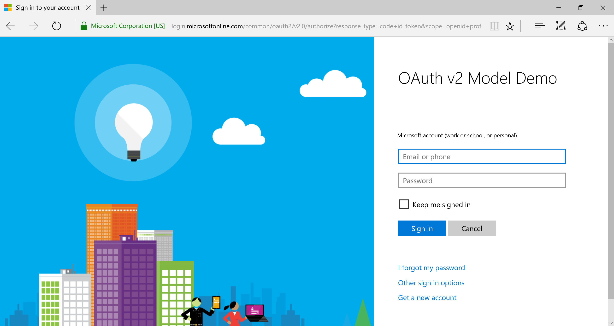

#Authenticating with Azure v2 App Model

## Create the project and UI

1. Create a new **ASP.NET Web Application**. Name it `OAuthStarter` and click **OK**.

  

1. Click the **Change Authentication** button and change the authentication to **No Authentication**, and click **OK**. Click **OK** again to create the project.

  

1. Open the `./Views/Home/Index.cshtml` file and replace the entire contents with the following code:

  ```C#
  @{
    ViewBag.Title = "Home Page";
    ViewBag.LoginUri = ViewBag.LoginUri ?? "#";
    ViewBag.UserName = ViewBag.UserName ?? string.Empty;
    ViewBag.UserEmail = ViewBag.UserEmail ?? string.Empty;
    ViewBag.UserLoggedIn = ViewBag.UserLoggedIn ?? false;
  }

  <div class="jumbotron">
      <h1>Azure v2 App Model</h1>
      <p class="lead">This sample uses OAuth 2.0 to authenticate the user using the v2 app model.</p>
      @if (ViewBag.Message != null)
      {
      <p class="alert alert-warning">@ViewBag.Message</p>
      }
      @if (ViewBag.UserLoggedIn)
      {
      <p>Hello @ViewBag.UserName!</p>
      }
      else
      {
      <p><a class="btn btn-primary btn-lg" href="@ViewBag.LoginUri.ToString()">Click here to login</a></p>
      }
  </div>
  ```
  
1. Now let's add a "Logout" button to the nav bar. Open the `./Views/Shared/_Layout.cshtml` file. Immediately after this bit of code:

  ```C#
  <ul class="nav navbar-nav">
      <li>@Html.ActionLink("Home", "Index", "Home")</li>
      <li>@Html.ActionLink("About", "About", "Home")</li>
      <li>@Html.ActionLink("Contact", "Contact", "Home")</li>
  </ul>
  ```
  
  Add:
  
  ```C#
  @if (null != ViewBag.UserLoggedIn && ViewBag.UserLoggedIn)
  {
  <ul class="nav navbar-nav navbar-right">
      <li>@Html.ActionLink("Logout", "Logout", "OAuth")</li>
  </ul>
  }
  ```
  
1. To make it easier to see the authentication in action, let's add a debug output to the bottom of our page. In `./Views/Shared/_Layout.cshtml`, add the following code immediately before the `<footer>` element:

  ```C#
  @if (null != ViewBag.DebugData && ViewBag.DebugData.Count > 0)
  {
      string debugOut = string.Empty;
      foreach (KeyValuePair<string, string> debugItem in ViewBag.DebugData)
      {
          debugOut += string.IsNullOrEmpty(debugOut) ? string.Empty : "\n\n";
          debugOut += string.Format("{0}: {1}", debugItem.Key, debugItem.Value);
      }

  <pre>@debugOut</pre>
  }
  ```
  
1. In case of errors, let's add an `Error` method to the `HomeController` class:

  ```C#
  public ActionResult Error()
  {
    ViewBag.ErrorMessage = TempData["error_message"];
    return View();
  }
  ```
 
1. Finally, modify the `./Views/Shared/Error.cshtml` file to display the error message. Add the following line immediately after the `</hgroup>` line:

  ```C#
  <div class="alert alert-danger">@ViewBag.ErrorMessage</div>
  ```
  
## Register the application

1. Open the `./Web.config` file. Locate the `<appSettings>` element. Add the following lines inside the `<appSettings>` element:

  ```xml
  <add key="ida:AppId" value="APP ID HERE"/>
  <add key="ida:AppSecret" value="APP SECRET HERE"/>
  ```
  
1. In Solution Explorer, right-click the `OAuthStarter` project and choose **Properties**. Select **Web** in the left-hand list. Locate the **Project Url** field, and make note of the port number included in the URL.  You'll need this value soon. For example, in this screenshot, the port number is **53674**.

  

1. Open your browser and go to https://apps.dev.microsoft.com. Sign in with either your Microsoft account (an Outlook.com, Hotmail.com, Live.com, etc. address) or an Office 365 account.

1. Click the **Add an app** button. Enter a descriptive name and click "Create application".

1. Copy the value of the **Application Id** and replace the `APP ID HERE` placeholder with that value.

1. Switch back to your browser and locate the **Application Secrets** section. Click the **Generate New Password** button. Copy the password from the pop-up, and replace the `APP SECRET HERE` placeholder in Web.config with that value.

1. Switch back to your browser and click **Ok** on the pop-up. Locate the **Platforms** section and click **Add Platform**.

1. In the pop-up, choose **Web**. Under **Redirect URIs** enter `http://localhost:<PORT>/OAuth/Authorize`, replacing `<PORT>` with the port number you located in step 2. This value is case-sensitive.

1. Click **Save** to complete the registration.

## Implement OAuth

### Requesting an authorization code and ID token

1. First let's create a folder to hold all of our authentication code. Right-click the project in Solution Explorer and choose **Add**, then **New Folder**. Name the folder `Auth`.

1. Now let's create a helper class to perform all of our OAuth-related actions. Right-click the `Auth` folder and choose **Add**, then **Class**. Name the class `OAuthHelper` and click **Add**. Replace the entire contents of the file with the following code:

  ```C#
  using System;
  using System.Collections.Generic;
  using System.Net.Http;
  using System.Net.Http.Headers;
  using System.Threading.Tasks;
  using System.Web;
  using Newtonsoft.Json;
  using Newtonsoft.Json.Linq;

  namespace OAuthStarter.Auth
  {
    public class OAuthHelper
    {
      // The v2 app model endpoints
      private static string authEndpoint = "/oauth2/v2.0/authorize";
      private static string tokenEndpoint = "/oauth2/v2.0/token";

      // This is the logon authority
      // i.e. https://login.microsoftonline.com/common
      public string Authority { get; set; }
      // This is the application ID obtained from registering at
      // https://apps.dev.microsoft.com
      public string AppId { get; set; }
      // This is the application secret obtained from registering at
      // https://apps.dev.microsoft.com
      public string AppSecret { get; set; }

      public OAuthHelper(string authority, string appId, string appSecret)
      {
        Authority = authority;
        AppId = appId;
        AppSecret = appSecret;
      }
    }
  }
  ```
  
1. Now let's add a method to the `OAuthHelper` class to generate a logon URL. Add the following methods:

  ```C#
  // Builds the authorization URL where the app sends the user to sign in
  public string GetAuthorizationUrl(string[] scopes, string redirectUri, string state, string nonce)
  {
    // Start with the base URL
    UriBuilder authUrl = new UriBuilder(this.Authority + authEndpoint);

    authUrl.Query =
      "response_type=code+id_token" +
      "&scope=openid+profile+offline_access+" + GetEncodedScopes(scopes) +
      "&state=" + state +
      "&nonce=" + nonce + 
      "&client_id=" + this.AppId +
      "&redirect_uri=" + HttpUtility.UrlEncode(redirectUri) +
      "&response_mode=form_post";

    return authUrl.ToString();
  }
  
  private string GetEncodedScopes(string[] scopes)
  {
    string encodedScopes = string.Empty;
    foreach(string scope in scopes)
    {
      if (!string.IsNullOrEmpty(encodedScopes)) { encodedScopes += '+'; }
      encodedScopes += HttpUtility.UrlEncode(scope);
    }
    return encodedScopes;
  }
  ```
  This code builds a logon URL by filling in all of the query parameters based on the application ID, the [permission scopes required by the app](https://azure.microsoft.com/en-us/documentation/articles/active-directory-v2-scopes/), and the redirect URL.
  
### Receiving the authorization code and ID token
  
1. Let's start by creating a helper class to parse the OpenID token that is returned along with the authorization code in the first phase of authentication. Right-click the `Auth` folder and choose **Add**, then **Class**. Name the class `OpenIdToken` and click **Add**. Replace the entire contents of this file with the following code:

  ```C#
  using Newtonsoft.Json;
  using System;
  using System.Globalization;
  using System.Text;

  namespace OAuthStarter.Auth
  {
    public class OpenIdToken
    {
      // Reference: https://azure.microsoft.com/en-us/documentation/articles/active-directory-v2-tokens/
      [JsonProperty("aud")]
      public string Audience;
      [JsonProperty("iss")]
      public string Issuer;
      [JsonProperty("iat")]
      public string IssuedAt;
      [JsonProperty("exp")]
      public string ExpirationTime;
      [JsonProperty("nbf")]
      public string NotBefore;
      [JsonProperty("ver")]
      public string Version;
      [JsonProperty("tid")]
      public string TenantId;
      [JsonProperty("c_hash")]
      public string CodeHash;
      [JsonProperty("at_hash")]
      public string AccessTokenHash;
      [JsonProperty("nonce")]
      public string Nonce;
      [JsonProperty("name")]
      public string Name;
      [JsonProperty("email")]
      public string Email;
      [JsonProperty("preferred_username")]
      public string PreferredUsername;
      [JsonProperty("sub")]
      public string Subject;
      [JsonProperty("oid")]
      public string ObjectId;

      public static OpenIdToken ParseOpenIdToken(string idToken)
      {
        string encodedOpenIdToken = idToken;

        string decodedToken = Base64UrlDecodeJwtTokenPayload(encodedOpenIdToken);

        OpenIdToken token = JsonConvert.DeserializeObject<OpenIdToken>(decodedToken);

        return token;
      }

      public bool Validate(string nonce)
      {
        if (string.IsNullOrEmpty(nonce) || string.IsNullOrEmpty(this.Nonce))
        { // nothing to validate
          return false;
        }
        if (this.Nonce.Equals(nonce))
        { 
          // TODO: Add validation of the token's signature
          return true;
        }

        return false;
      }

      private static string Base64UrlDecodeJwtTokenPayload(string base64UrlEncodedJwtToken)
      {
        string payload = base64UrlEncodedJwtToken.Split('.')[1];
        return Base64UrlEncoder.Decode(payload);
      }
    }

    public static class Base64UrlEncoder
    {
      static char Base64PadCharacter = '=';
      static string DoubleBase64PadCharacter = String.Format(CultureInfo.InvariantCulture, "{0}{0}", Base64PadCharacter);
      static char Base64Character62 = '+';
      static char Base64Character63 = '/';
      static char Base64UrlCharacter62 = '-';
      static char Base64UrlCharacter63 = '_';

      public static byte[] DecodeBytes(string arg)
      {
        string s = arg;
        s = s.Replace(Base64UrlCharacter62, Base64Character62); // 62nd char of encoding
        s = s.Replace(Base64UrlCharacter63, Base64Character63); // 63rd char of encoding
        switch (s.Length % 4) // Pad 
        {
          case 0:
            break; // No pad chars in this case
          case 2:
            s += DoubleBase64PadCharacter; break; // Two pad chars
          case 3:
            s += Base64PadCharacter; break; // One pad char
          default:
            throw new ArgumentException("Illegal base64url string!", arg);
        }
        return Convert.FromBase64String(s); // Standard base64 decoder
      }

      public static string Decode(string arg)
      {
        return Encoding.UTF8.GetString(DecodeBytes(arg));
      }
    }
  }
  ```
  
1. Next let's implement a redirect method in the app. This is the page that the Azure authorization page will redirect to once the user has logged in and given consent to the requested resources. Right-click the `Controllers` folder in Solution Explorer and choose **Add**, then **Controller**. Choose **MVC 5 Controller - Empty** and click **Add**. Make the name `OAuthController` and click **Add**. Replace the entire contents of the file with the following code:

  ```C#
  using System;
  using System.Collections.Generic;
  using System.Linq;
  using System.Threading.Tasks;
  using System.Web;
  using System.Web.Mvc;
  using OAuthStarter.Auth;

  namespace OAuthStarter.Controllers
  {
    public class OAuthController : Controller
    {
      // The Azure login authority
      private static string authority = "https://login.microsoftonline.com/common";
      // The application ID from https://apps.dev.microsoft.com
      private static string appId = System.Configuration.ConfigurationManager.AppSettings["ida:AppID"];
      // The application secret from https://apps.dev.microsoft.com
      private static string appSecret = System.Configuration.ConfigurationManager.AppSettings["ida:AppSecret"];
      
      public async Task<ActionResult> Authorize()
      {
        Dictionary<string,string> debug = new Dictionary<string, string>();

        string authState = Request.Params["state"];
        string expectedState = (string)Session["auth_state"];
        Session.Remove("auth_state");

        debug.Add("Returned auth state", authState);
        debug.Add("Expected auth state", expectedState);

        // Make sure that the state passed by the caller matches what we expect
        if (!authState.Equals(expectedState))
        {
          TempData["error_message"] = "The auth state did not match the expected value. Please try again.";
          return RedirectToAction("Error");
        }

        string authCode = Request.Params["code"];
        string idToken = Request.Params["id_token"];

        // Make sure we got back an auth code and ID token
        if (string.IsNullOrEmpty(authCode) || string.IsNullOrEmpty(idToken))
        {
          // If not, check the error and error_desription parameters for more information
          string error = Request.Params["error"];
          string error_description = Request.Params["error_description"];

          if (string.IsNullOrEmpty(error) && string.IsNullOrEmpty(error_description))
          {
            TempData["error_message"] = "Missing authorization code and/or ID token from redirect.";
          }
          else
          {
            TempData["error_message"] = string.Format("Error: {0} - {1}", error, error_description);
          }

          return RedirectToAction("Error");
        }

        debug.Add("Authorization code", authCode);
        debug.Add("ID token", idToken);

        // Check the nonce in the ID token against what we expect
        string nonce = (string)Session["auth_nonce"];
        Session.Remove("auth_nonce");

        OpenIdToken userId = OpenIdToken.ParseOpenIdToken(idToken);
        if (!userId.Validate(nonce))
        {
          TempData["error_message"] = "Invalid ID token.";
          return RedirectToAction("Error");
        }

        // Fill in user's information from token
        Session["user_name"] = userId.Name;
        Session["user_email"] = userId.PreferredUsername;

        // Pass debug in TempData to preserve information
        // over the redirect
        TempData["debug"] = debug;

        return Redirect("/");
      }
    }
  }
  ```
  
1. Open the `./Controller/HomeController.cs` file and add the following properties to the `HomeController` class:

  ```C#
  // The Azure login authority
  private static string authority = "https://login.microsoftonline.com/common";
  // The application ID from https://apps.dev.microsoft.com
  private static string appId = System.Configuration.ConfigurationManager.AppSettings["ida:AppId"];
  // The application secret from https://apps.dev.microsoft.com
  private static string appSecret = System.Configuration.ConfigurationManager.AppSettings["ida:AppSecret"];

  // The required scopes for our app
  // TODO: Modify this to reflect the scopes your app requires
  private static string[] scopes = { "https://graph.microsoft.com/User.Read" };
  ```

1. In `./Controller/HomeController.cs` replace the `Index` method with the following code:

  ```C#
  public ActionResult Index()
  {
    // If any message was returned, add it to the ViewBag
    ViewBag.Message = TempData["message"];
    
    // If any debug data was passed via redirect, copy it
    ViewBag.DebugData = TempData["debug"];

    // Add user info to view if present
    string userName = (string)Session["user_name"];
    string userEmail = (string)Session["user_email"];

    ViewBag.UserLoggedIn = !string.IsNullOrEmpty(userName) && !string.IsNullOrEmpty(userEmail);

    if (!ViewBag.UserLoggedIn)
    {
      // Get the full URL to /OAuth/Authorize
      string authRedirect = Url.Action("Authorize", "OAuth", null, Request.Url.Scheme);

      // The state is used to help protect against cross-site forgery attacks
      string state = Guid.NewGuid().ToString();
      // The nonce value is used to help validate the ID token
      // returned as part of the OpenID flow
      string nonce = Guid.NewGuid().ToString();
      Session["auth_state"] = state;
      Session["auth_nonce"] = nonce;

      // Create an OAuth helper
      OAuthHelper oauthHelper = new OAuthHelper(authority, appId, appSecret);
      string loginUri = oauthHelper.GetAuthorizationUrl(scopes, authRedirect, state, nonce);
      ViewBag.LoginUri = loginUri;

      ViewBag.DebugData = ViewBag.DebugData ?? new Dictionary<string, string>();
      ViewBag.DebugData.Add("State", state);
      ViewBag.DebugData.Add("Nonce", nonce);
      ViewBag.DebugData.Add("Logon URL", loginUri);
    }
    else
    {
      ViewBag.UserName = userName;
      ViewBag.UserEmail = userEmail;
    }

    return View();
  }
  ```

### Run the app

At this point if you run the app, you can log in and see the authorization code and ID token.

The app starts:


Clicking the **Click here to login** button takes the user here:



Once logged in, the user is prompted for consent to the requested scopes:


If the user grants access, the browser is redirected back to the app:


### Exchange the authorization code for an access token

1. Right-click the `Auth` folder in Solution Explorer and choose **Add**, then **Class**. Name the class `TokenRequestResponses` and click **Add**. Replace the entire contents of the file with the following code:

  ```C#
  
  ```
  
1. Now let's add a method to send a request to the token endpoint to get back an access token. Open the `./Auth/OAuthHelper.cs` file and add the following method to the `OAuthHelper` class:

  ```C#
  // Makes a POST request to the token endopoint to get an access token using either
  // an authorization code or a refresh token. This will also add the tokens
  // to the local cache.
  public async Task<TokenRequestSuccessResponse> GetTokensFromAuthority(string grantType, string grantParameter, string redirectUri, string userId)
  {
    // Build the token request payload
    FormUrlEncodedContent tokenRequestForm = new FormUrlEncodedContent(
      new[]
      {
        new KeyValuePair<string,string>("grant_type", grantType),
        new KeyValuePair<string,string>("code", grantParameter),
        new KeyValuePair<string,string>("client_id", this.AppId),
        new KeyValuePair<string,string>("client_secret", this.AppSecret),
        new KeyValuePair<string,string>("redirect_uri", redirectUri)
      }
    );

    using (HttpClient httpClient = new HttpClient())
    {
      string requestString = tokenRequestForm.ReadAsStringAsync().Result;
      StringContent requestContent = new StringContent(requestString);
      requestContent.Headers.ContentType = new MediaTypeHeaderValue("application/x-www-form-urlencoded");

      // Set up the HTTP POST request
      HttpRequestMessage tokenRequest = new HttpRequestMessage(HttpMethod.Post, this.Authority + tokenEndpoint);
      tokenRequest.Content = requestContent;
      tokenRequest.Headers.UserAgent.Add(new ProductInfoHeaderValue("OAuthStarter", "1.0"));
      tokenRequest.Headers.Add("client-request-id", Guid.NewGuid().ToString());
      tokenRequest.Headers.Add("return-client-request-id", "true");

      // Send the request and read the JSON body of the response
      HttpResponseMessage response = await httpClient.SendAsync(tokenRequest);
      JObject jsonResponse = JObject.Parse(response.Content.ReadAsStringAsync().Result);
      JsonSerializer jsonSerializer = new JsonSerializer();

      if (response.IsSuccessStatusCode)
      {
        // Parse the token response
        TokenRequestSuccessResponse s = (TokenRequestSuccessResponse)jsonSerializer.Deserialize(
          new JTokenReader(jsonResponse), typeof(TokenRequestSuccessResponse));

        // Save the tokens
        SaveUserTokens(userId, s);
        return s;
      }
      else
      {
        // Parse the error response
        TokenRequestErrorResponse e = (TokenRequestErrorResponse)jsonSerializer.Deserialize(
          new JTokenReader(jsonResponse), typeof(TokenRequestErrorResponse));

        // Throw the error description
        throw new Exception(e.Description);
      }
    }
  }
  ```
  
1. Next let's implement a method to save the user's tokens. Access tokens are valid for an hour, so we can reuse the access token until it expires. Add the following method to the `OAuthHelper` class:

  ```C#
  public void SaveUserTokens(HttpSessionStateBase session, TokenRequestSuccessResponse tokens)
  {
    // Just save the tokens in the session
    // This works for a demo app, but to be more fault tolerant and secure
    // production apps should explore other storage options, such as a secured
    // database

    // The ID token can be parsed to get the user's ObjectId, which is a unique
    // identifier that can be used as a key to store the user's tokens
    // E.g. OpenIdToken idToken = OpenIdToken.ParseOpenIdToken(tokens.IdToken);

    session["access_token"] = tokens.AccessToken;
    session["refresh_token"] = tokens.RefreshToken;
    // Expire token slightly early (5 minutes) to avoid
    // problems with inconsistencies in clock times
    session["token_expires"] = DateTime.UtcNow.AddSeconds(Int32.Parse(tokens.ExpiresIn) - 300);
  }
  ```
  
1. Now let's add a method to return the saved user's access token to the app. The method will check if it should refresh the token before returning it. Add the following method to the `OAuthHelper` class:

  ```C#
  public async Task<string> GetUserAccessToken(HttpSessionStateBase session, string redirectUri)
  {
    if (null == session["access_token"] || null == session["token_expires"])
      return string.Empty;

    string accessToken = (string)session["access_token"];
    DateTime expireTime = (DateTime)session["token_expires"];

    if (expireTime < DateTime.UtcNow)
    {
      // Token is expired, request a new one with the refresh token
      string refreshToken = (string)session["refresh_token"];
      if (string.IsNullOrEmpty(refreshToken))
      {
        // No refresh token
        return string.Empty;
      }

      var response = await GetTokensFromAuthority("refresh_token", refreshToken, redirectUri, session);
      return response.AccessToken;
    }
    else
    {
      // Token is still good, return it
      return accessToken;
    }
  }
  ```
  
1. Next let's add a method to delete the user's tokens from storage. Add the following method to the `OAuthHelper` class:

  ```C#
  public void Logout(HttpSessionStateBase session)
  {
    session.Remove("user_name");
    session.Remove("user_email");
    session.Remove("access_token");
    session.Remove("refresh_token");
    session.Remove("token_expires");
  }
  ```
  
1. Let's modify the `Authorize` method to use this new code to get an access token. Open the `./Controllers/OAuthController.cs` file and locate the `Authorize` method. Add the following code after the `Session["user_email"] = userId.PreferredUsername;` line:

  ```C#
  // Request an access token
  OAuthHelper oauthHelper = new OAuthHelper(authority, appId, appSecret);
  string redirectUri = Url.Action("Authorize", "OAuth", null, Request.Url.Scheme);
  try
  {
    var response = await oauthHelper.GetTokensFromAuthority("authorization_code",
      authCode, redirectUri, Session);

    debug.Add("Access Token", response.AccessToken);
    debug.Add("Refresh Token", response.RefreshToken);
  }
  catch (Exception ex)
  {
    TempData["error_message"] = string.Format("Error requesting access token: {0}", ex.Message);
    return RedirectToAction("Error", "Home");
  }
  ```
  
1. Finally, add a method to the `OAuthController` class to allow the user to logout.

  ```C#
  public ActionResult Logout()
  {
    OAuthHelper oauthHelper = new OAuthHelper(authority, appId, appSecret);
    oauthHelper.Logout(Session);
    TempData["message"] = "Logged out";
    return Redirect("/");
  }
  ```
  
1. Save all changes and run the app. Login as before. Now you should see an access and refresh token in the debug output.

  

## Call the Graph API (Optional)

In this section we'll add a page to the app to make basic Graph API calls using the access token we've obtained.

1. Open the `./Content/Site.css` file and remove the following lines:

  ```css
  /* Set width on the form input elements since they're 100% wide by default */
  input,
  select,
  textarea {
      max-width: 280px;
  }
  ```

1. Open the `./Views/Shared/_Layout.cshtml` file. Add the following code immediately before the `<li>@Html.ActionLink("Logout", "Logout", "OAuth")</li>` line:

  ```C#
  <li>@Html.ActionLink("Graph", "Graph", "Home")</li>
  ```
  
1. Expand the `Views` folder in Solution Explorer, then right-click the `Home` folder and choose **Add**, then **MVC 5 View Page (Razor)**. Name the page `Graph` and click **OK**. Replace the entire contents of the file with the following code:

  ```C#
  @{
    ViewBag.Title = "Graph Tester";
  }

  <h1>Graph Tester</h1>

  <input type="hidden" id="access-token" value="@ViewBag.AccessToken" />
  <div class="row">
      <div class="col-sm-12">
          <div class="input-group">
              <input type="text" class="form-control" id="request-url" value="https://graph.microsoft.com/v1.0/me" />
              <span class="input-group-btn">
                  <button class="btn btn-default" type="button" id="submit-request">Go!</button>
              </span>
          </div>
      </div>
  </div>
  <div class="row">
      <div class="col-sm-12">
          <label for="response-body">Response</label>
          <div id="response-body">
              <pre></pre>
          </div>
      </div>
  </div>

  @section scripts {
      <script>
          $(function () {

              $('#submit-request').click(function (event) {
                  var token = $('#access-token').val();
                  var url = $('#request-url').val();
                  $.ajax({
                      url: './SendGraphRequest',
                      dataType: 'json',
                      type: 'POST',
                      data: {
                          'accessToken': token,
                          'requestUrl': url
                      }
                  })
                  .done(function (data) {
                      var response = JSON.parse(data);
                      $('#response-body').find("pre").text(JSON.stringify(response, null, 2));
                  });
              });
          });
      </script>
  }
  ```

1. Open the `./Controllers/HomeController.cs` file and add the following `using` directives to the top of the file:

  ```C#
  using System.Net.Http;
  using System.Net.Http.Headers;
  using System.Threading.Tasks;
  ```
  
1. Add the following methods to the `HomeController` class:

  ```C#
  public async Task<ActionResult> Graph()
  {
    // Add user info to view if present
    string userName = (string)Session["user_name"];
    string userEmail = (string)Session["user_email"];

    ViewBag.UserLoggedIn = !string.IsNullOrEmpty(userName) && !string.IsNullOrEmpty(userEmail);
    if (!ViewBag.UserLoggedIn)
    {
      TempData["message"] = "Please log in.";
      return Redirect("/");
    }

    ViewBag.UserName = userName;
    ViewBag.UserEmail = userEmail;

    // Get the user's access token
    string redirectUri = Url.Action("Authorize", "OAuth", null, Request.Url.Scheme);
    OAuthHelper oauthHelper = new OAuthHelper(authority, appId, appSecret);

    string accessToken = await oauthHelper.GetUserAccessToken(Session, redirectUri);
    if (string.IsNullOrEmpty(accessToken))
    {
      TempData["message"] = "Access token missing. Please log out and log in again.";
      return Redirect("/");
    }

    ViewBag.AccessToken = accessToken;

    return View();
  }

  [HttpPost]
  public async Task<ActionResult> SendGraphRequest(string accessToken, string requestUrl)
  {
    using (HttpClient httpClient = new HttpClient())
    {
      // Set up the HTTP GET request
      HttpRequestMessage apiRequest = new HttpRequestMessage(HttpMethod.Get, requestUrl);
      apiRequest.Headers.UserAgent.Add(new ProductInfoHeaderValue("OAuthStarter", "1.0"));
      apiRequest.Headers.Authorization = new AuthenticationHeaderValue("Bearer", accessToken);
      apiRequest.Headers.Add("client-request-id", Guid.NewGuid().ToString());
      apiRequest.Headers.Add("return-client-request-id", "true");

      // Send the request and return the JSON body of the response
      HttpResponseMessage response = await httpClient.SendAsync(apiRequest);
      return Json(response.Content.ReadAsStringAsync().Result);
    }
  }
  ```
  
1. Save all changes and restart the app. Login as before, then click the **Graph** link in the top navigation bar. Click the **Go!** button to send a GET request to `https://graph.microsoft.com/v1.0/me`.

  